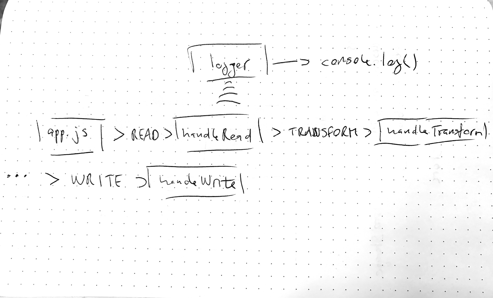

# LAB - 16

## Event Driven Appliations

### Author: Joé Jemmely

### Links and Resources

- [submission PR](https://github.com/401-advanced-javascript-joejemmely/lab-16/pull/1)
- [travis](https://travis-ci.com/401-advanced-javascript-joejemmely/lab-16)

### Documentation

## eventEmitter

Create an eventEmitter

## event-names

Export constant for the events

## handleRead(file)

Read handler function

**Kind**: global function

| Param | Type            |
| ----- | --------------- |
| file  | <code>\*</code> |

## handleTransform(type, buffer, file)

Transform handler function

**Kind**: global function

| Param  | Type                |
| ------ | ------------------- |
| type   | <code>string</code> |
| buffer | <code>buffer</code> |
| file   | <code>\*</code>     |

## handleWrite(file, buffer)

Write handler function

**Kind**: global function

| Param  | Type                |
| ------ | ------------------- |
| file   | <code>\*</code>     |
| buffer | <code>buffer</code> |

## log(event, payload)

Logger function

**Kind**: global function

| Param   | Type            |
| ------- | --------------- |
| event   | <code>\*</code> |
| payload | <code>\*</code> |

## uppercaseBuffer

Return an uppercased buffer ⇒ <code>buffer</code>
**Returns**: <code>buffer</code> - - uppercased buffer

| Param  | Type                |
| ------ | ------------------- |
| buffer | <code>buffer</code> |

#### Running the app

- `npm start <filename.ext>`

#### Tests

- How do you run tests? `npm test`

#### UML

